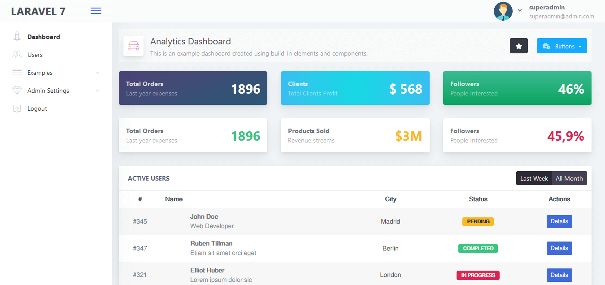
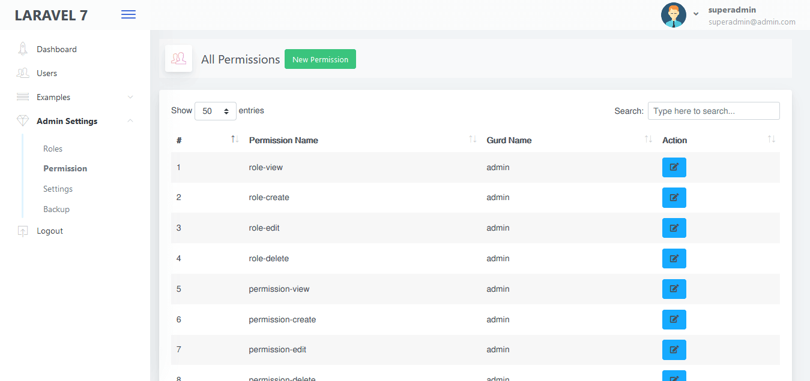
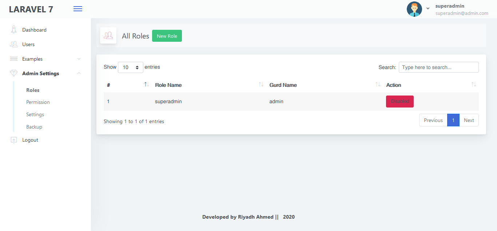
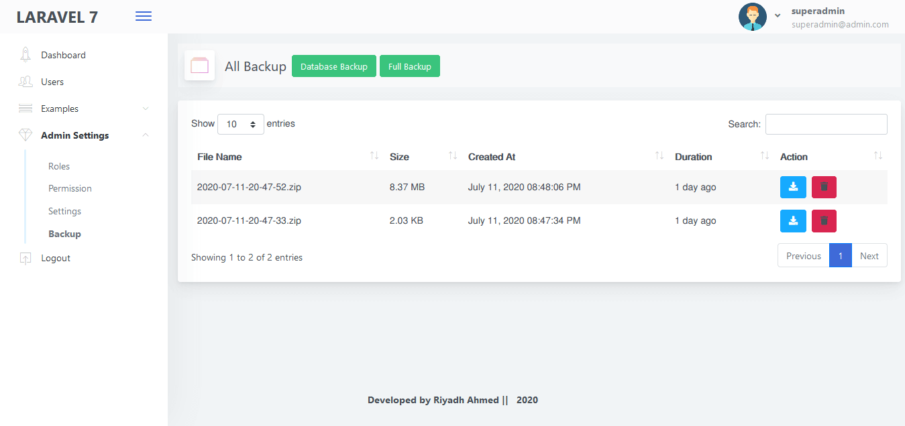

# Laravel 7 Boilerplate 

## Features

    1. Laravel 7 Framework
    2. Laravel-Permission by spatie/laravel-permission
    3. Laravel Backup by spatie/laravel-backup
    4. Barcode
    4. Yajra Datatable by Yajra
    5. Laravel Debugbar
    6. Laravel Passport Authentication
    7. Laravel Ajax CRUD
    8. Bootstrap 4
    9. Architect Admin Template
    10. Multi Auth
    11. Admin Panel & User Panel

### Requirements

    1. PHP version upto 7.2    
    2. Laravel version  7  

### Installation

    1. Clone the project using git clone   
    2. Copy a fresh .env file from laravel github    
    3. Update .env file by adding database information like DB_HOST.  
    4. Go to project root folder.Open git bash or terminal and run  composer install       
    5. Run php artisan key:generate in the terminal    
    6. Run php artisan migrate  // Alternate import db.sql from db folder
    
### Seeder Class
    1. php artisan db:seed   to seed all seeder  
      
    
### Troubleshootings
    
    All Models are in App/Models folder
    
    1. Add 'model' => App\Models\User::class, in config/auth.php providers
    2. Change Db port in config/database.php file or change as yours.
    3. Try composer composer dump-autoload if need
    4. php artisan config:cache if need
    5. php artisan clear-compiled if need    
    
### Note*
    
    Don't delete or edit already added permissions to avoid error   
    
         
### Login
         // admin
         email : superadmin@admin.com
         pass :  123456
         
         // user
         email:userone@admin.com
         pass : 123456

         
## Credit

    1. Laravel 7 Framework
    2. Laravel-Permission by spatie/laravel-permission
    3. Laravel Backup by spatie/laravel-backup
    4. Yajra Datatable by Yajra
    5. Barcode by Milon
    6. Laravel Debugbar
    7. Laravel Passport Authentication
    8. Bootstrap 4
    9. Architect Admin Template
        
Screenshot : 

 Find me on  Linkedin  : [My Linkedin profile  link](https://www.linkedin.com/in/monjur-morshed-riyadh-6aaba465/)  \
 Email me : riyadhahmed777@gmail.com